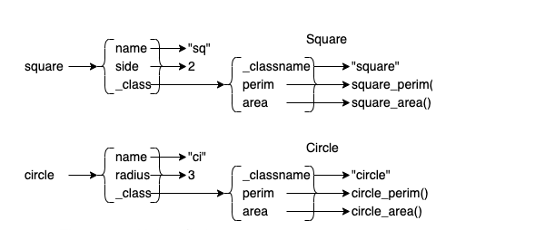
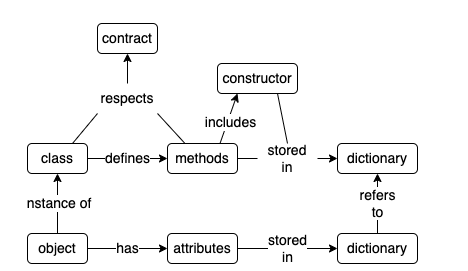

使用面相对象编程(OOP)的时候，会创建许多的类和对象，如果理解他们是如何实现的，那么使用他们将会更加简单。
面相对象编程解决了两个问题：
1. 代码中表示真是世界中的“事物”的方式是什么？
2. 如何组织代码可以使其更容易理解、测试及扩展？

<!--more-->

# 对象
Python代码中，我们定义一个类作为通用的抽象基类，可以使用如下代码：
```python
class Shape:
    def __init__(self, name):
        self.name = name
    
    def perimeter(self):
        raise NotImplementedError("perimeter")
    
    def area(self):
        raise NotImplementedError("area")
```

作为一个基类，实质上不存在直接被使用的情况，其作用是为其子类定义一个规范，也称为契约，换而言之，所有继承自该基类的子类都需要实现基类定义的方法，如下：
```python
import math

class Square(Shape):
    def __init__(self, name, side):
        super().__init__(name)
        self.side = side
    
    def perimeter(self):
        return 4 * self.side
    
    def area(self):
        return self.side ** 2


class Circle(Shape):
    def __init__(self, name, radius):
        super().__init__(name)
        self.radius = radius
    
    def perimeter(self):
        return 2 * math.pi * self.radius
    
    def area(self):
        return math.pi * self.radius ** 2
```
上述代码通过继承的方式，实现了各自对象的具体方法，这种方式的好处是，这两个类实例化之后的对象可以互换的使用。具体来说就是，由于两个子类都继承自同一个基类`Shape`，那么基类中存在的方法自然而然的就都可以在子类的实例对象上调用。这样可以有效的减低调用者的认知负担，如下：
```python
examples = [Square("sq", 3), Circle("ci", 2)]
for thing in examples:
    n = thing.name
    p = thing.perimeter()
    a = thing.area()
    print(f"{n} has perimeter {p:.2f} and area {a:.2f}")
```
输出：
```bash
sq has perimeter 12.00 and area 9.00
ci has perimeter 12.57 and area 12.57
```

那么多态性是如何发挥作用的？我们都知道Python中，函数是对象，这样就可以将函数赋值，然后再别处调用。那么对于上述代码实现的类而言，不使用类的方式而产生同样的效果也是可行的，如下：
```python
def square_perimeter(thing):
    return 4 * thing["side"]

def square_area(thing):
    return thing["side"] ** 2

def square_new(name, side):
    return {
        "name": name,
        "side": side,
        "perimeter": square_perimeter,
        "area": square_area
    }
```
通过分别定义三个函数，我们实现了与类定义同样的效果，其中关键在于使用了Python字典(dict)数据结构实现对象的属性聚合。
接着就需要考虑怎么调用对象的方法和获取对象的属性，如下:
```python
def call(thing, method_name):
    return thing[method_name](thing)

examples = [square_new("sq", 3), circle_new("ci", 2)]
for ex in examples:
    n = ex["name"]
    p = call(ex, "perimeter")
    a = call(ex, "area")
    print(f"{n} {p:.2f} {a:.2f}")
```

函数`call`调用对象字典中存储的方法对象，也就是说，我们使用`obj['method'](obj, arg)`的调用方式模拟了`obj.method(arg)`的调用方式。
这种方式原理上就是对象实际的工作方式，换言之，我们可以将对象当做一种特殊的字典结构对待，对象的方法也是一个函数，其第一个参数就是对象本身（Python中通常表示为self）。

# 类
使用字典模拟的对象目前看起来运行良好，但是还是有改进的空间。首先，我们需要确认的是，同类型的对象其属性可以不同，但是他们具有相同的行为。也就是说，行为可以被抽象出来聚合在一起。按照前面的方式，可以定义一个对象，将行为聚合在一起，然后存储在字典中，如下：
```python
def square_perimeter(thing):
    return 4 * thing["side"]

def square_area(thing):
    return thing["side"] ** 2

Square = {
    "perimeter": square_perimeter,
    "area": square_area,
    "_classname": "Square"
}

def square_new(name, side):
    return {
        "name": name,
        "side": side,
        "_class": Square
    }
```
上述实现中，我们将方法存储在一个字典中（Square），方法与类建立了对应关系，每个对象实例包含了对该字典(模拟类)的引用，那么这样一来，方法的调用变成如下图所示：

`call`函数也需要做一些对应的更新：
```python
def call(thing, method_name):
    return thing["_class"][method_name](thing)

examples = [square_new("sq", 3), circle_new("ci", 2)]
for ex in examples:
    n = ex["name"]
    p = call(ex, "perimeter")
    a = call(ex, "area")
    c = ex["_class"]["_classname"]
    print(f"{n} is a {c}: {p:.2f} {a:.2f}")
```
通过代码的修改，我们可以实现识别对象的类是什么，并通过检查两个对象的"_class"键的值，确定两个对象是否同属一类。

# 3 参数
目前为止，通过定义将方法定义为模拟类（字典）中存储的值进行调用，这种方式看着运行正常，但是存在的问题是：当前方法中的参数都是存储在对象中的，暂时没有从外部传递参数作为方法的输入。但是我们需要实现这个功能。该功能的实现有一些麻烦，因为不同的方法需要传递参数的数量是不同的。假设我们定义一系列方法，如：`call_0`、`call_1`等来处理不同的调用情况，也是可行的。但是，Python已经提供了一个更好的方式来处理这种问题，即使用`*args`和`**kwargs`分别捕获额外的位置参数和命名参数：
```python
def show_args(title, *args, **kwargs):
    print(f"{title} args '{args}' and kwargs '{kwargs}'")


show_args("nothing")
show_args("on unnamed argument", 1)
show_args("one named argument", second="2")
show_args("on of each", 3, fourth="4")
```
借助这个功能，可以向实现的模拟类中增加一个方法以判断正方形的面积是否大于用户需要的大小：
```python
def square_larger(thing, size):
    return call(thing, "area") > size

Square = {
    "perimeter": square_perimeter,
    "area": square_area,
    "larger": square_larger,
    "_classname": "Square"
}
```
然后修改定义的`call`函数，增加额外的位置参数的传递：
```python
def call(thing, method_name, *args):
    return thing["_class"][method_name](thing, *args)
```
接着测试代码的功能是否正常：
```python
examples = [square_new("sq", 3), circle_new("ci", 2)]

for ex in examples:
    result = call(ex, "larger", 10)
    print(f"is {ex['name']} larger? {result}")
```

结果是：
```bash
is sq larger? False
is ci larger? True
```
上述代码功能是正常的，但是现在存在的问题是，我们有两个函数在做同样的事情（尽管函数名称不一样），重复的代码带来的问题是显而易见的，因此需要将相同的功能尽可能的共享。

# 继承

关于继承，前面有过简单的提及，其工作原理在这部分做一个深入的描述。如下代码，我们为基类`Shape`增加一个方法：
```python
class Shape:
    def __init__(self, name):
        self.name = name

    def perimeter(self):
        raise NotImplementedError("perimeter")

    def area(self):
        raise NotImplementedError("area")

    def density(self, weight):
        return weight / self.area()
```
方法`density`定义在基类中，因此可以被其子类`Square`及`Circle`直接调用：
```python
examples = [Square("sq", 3), Circle("ci", 2)]
for ex in examples:
    n = ex.name
    d = ex.density(5)
    print(f"{n}: {d:.2f}")

# sq: 0.56
# ci: 0.40
```
上述代码就是类继承的一个最简单的表述形式，那么在我们使用字典模拟的类中如何实现同样的功能呢？
这里创建一个字典来表示基类`Shape`，并为其添加一个方法`density`：
```python
def shape_density(thing, weight):
    return weight / call(thing, "area")

Shape = {
    "density": shape_density,
    "_classname": "Shape",
    "_parent": None
}
```
这里需要注意的是，`_parent`字段的添加，用来表述模拟类之间的继承关系，前面定义的模拟类`Square`及`Circle`也需要做出相应的修改：
```python
Square = {
    "perimeter": square_perimeter,
    "area": square_area,
    "_classname": "Square",
    "_parent": Shape
}
```
相应的，也需要修改`call`函数的逻辑，因为`density`方法是从基类中继承的，那么就需要通过`call`函数去遍历方法列表，由子类向基类中查找是否实现了需要调用的方法，最终返回结果：
```python
def call(thing, method_name, *args):
    method = find(thing["_class"], method_name)
    return method(thing, *args)

def find(cls, method_name):
    while cls is not None:
        if method_name in cls:
            return cls[method_name]
        cls = cls["_parent"]
    raise NotImplementedError(f"{method_name}")
```
测试代码及输出如下：
```python
examples = [square_new("sq", 3), circle_new("ci", 2)]
for ex in examples:
    n = ex["name"]
    d = call(ex, "density", 5)
    print(f"{n}: {d:.2f}")


# sq: 0.56
# ci: 0.40
```
到此为止，通过字典模拟的类还遗留一个问题，即我们需要确保实例的生成是正确的。也就是说，需要实现一个构建函数（constructors）。对此，可以在字典中增加一个字段，该字段的值就是构造函数：
```python
def shape_new(name):
    return {
        "name": name,
        "_class": Shape
    }

Shape = {
    "density": shape_density,
    "_classname": "Shape",
    "_parent": None,
    "_new": shape_new
}

```
为了生成新的对象，需要调用与`_new`属性关联的函数：
```python
def make(cls, *args):
    return cls["_new"](*args)
```
`make`函数调用父类的构造函数生成新对象，如下，这里的`|`是将父类中的属性与子类中的属性聚合在一起，然后返回：
```python
def square_new(name, side):
    return make(Shape, name) | {
        "side": side,
        "_class": Square
    }

Square = {
    "perimeter": square_perimeter,
    "area": square_area,
    "_classname": "Square",
    "_parent": Shape,
    "_new": square_new
}
```

# 总结
上述过程只是接触到了Python对象系统的皮毛而已，其他形如：多重继承、类方法、静态方法及猴子补丁等都是强大的工具，但是，这些工具都可以通过包含属性、函数及其他字典引用的一个字典模拟类来理解。

