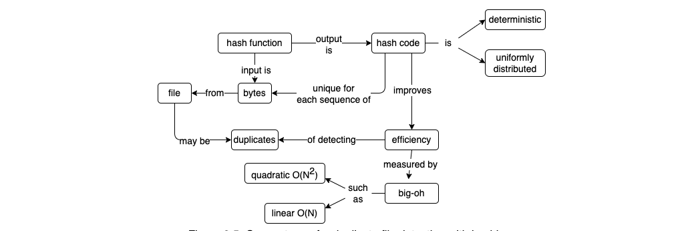

假设我们需要查找重复的文件，比如文本文档等，虽然两个文件的命名是相同的，但是其内容不一定一致。因此我们必须比较两者的内容才能确定两者是否一致，但是如果文件数量很多的情况下，这样的比较将会非常耗时。
当然，我们需要简单的估算一下这个“慢”的程度到底是怎么样的。
首先，$N$个对象的比较将会进行$N(N-1)$次数，然后去掉重复的比较，那么结果是$N(N-1)/2=(N^2-N)/2$次。
随着$N$变得越来越大，其结果与$N^2$越发趋近，那么就可以说该比较方式的算法复杂度是$O(N^2)$。
简而言之，文件数量增加2倍，则比较耗时增加4倍，即变“慢”4倍。

随着文件的增加，比较速度变慢是一个不可避免的事实，但是我们可以通过使用更优的解决方法，将这个耗时尽可能的降低。
如果为每个文件生成一个更短的标识符，这个标识符仅取决于文件所包含的字节，则可以将具有相同标识符的文件分组在一起，并且只比较同组的文件。这种方法更快速，因为只需要对相同组中的文件进行逐字节比较。
<!--more-->

# 开始
首先，我们从最简单也是最缓慢的诸字节比较法对文件进行比较，如下代码：
```python
def find_duplicates(filenames):
    matches = []
    for left in filenames:
        for right in filenames:
            if same_bytes(left, right):
                matches.append((left, right))
    return matches

def same_bytes(left_name, right_name):
    left_bytes = open(left_name, "rb").read()
    right_bytes = open(right, "rb").read()
    return left_bytes == right_bytes


if __name__ == "__main__":
    duplicates = find_duplicates(sys.argv[1:])
    for (left, right) in duplicates:
        print(left, right)
```
上述代码的运行结果存在一个问题：每一个文件都会被比较两次，并且每个文件都与自身进行了比较。这个明显是没有必要的，因此需要修改代码中的嵌套循环，以便于只进行一次比较：
```python
def find_duplicates(filenames):
    matches = []
    for i_left in range(len(filenames)):
        left = filenames[i_left]
        for i_right in range(i_left):
            right = filenames[i_right]
            if same_bytes(left, right):
                matches.append((left, right))
    return matches
```
其遍历顺序如下图所示：


# 文件哈希
与其将文件与每个其他文件进行比较，不如对每个文件进行一次处理，按照文件内容生成一个简短的标识符，然后只比较具有相同标识符的文件，这意味着两个文件可能内容相同。
假设文件平均分配到$g$个组，那么每个组就存在$N/g$个文件，则所有的文件对比的时间复杂度是$O(g(N/g)^2)$(简化之后就是$(N/g)^2$)。
接下来，我们简单的实现一个哈希函数，实现上述提及到的处理方案：
```python
def naive_hash(data):
    return sum(data) % 13
```
上述哈希函数十分简单，仅仅是将文件中的字节进行累加，然后对其取模获取一个结果。
可以看一下这个哈希函数的实际效果如何：
```python
example = byte("hashing", "utf-8")
for i in range(1, len(example) + 1):
    substring = example[:i]
    hash = naive_hash(substring)
    print(f"{hash:2} {substring}")
```
输出结果是：
```bash
 0 b'h'
 6 b'ha'
 4 b'has'
 4 b'hash'
 5 b'hashi'
11 b'hashin'
10 b'hashing'
```
需要注意的是，将文件进行哈希，我们需要的是文件尽可能的平均分配到$g$个组中，如果哈希函数不能保证文件或被对比的对象能尽可能的平均分配，那么这个哈希函数的实现是不可取的，这时候就需要重新实现一个函数对象，或对文件进行前置处理。

哈希是一个强大的工具：如Python中字典的键经过哈希之后，可以快速查找到对应的条目。接下来，按照这个思路，实现如下代码，我们将文件进行哈希，哈希值作为字典的键，而文件名作为字典的值。每次计算哈希值的时候，都会检查字典中是否已经存在该键，如果存在，则将文件添加到值的元组中，如果不存在，则在字典中创建一个新条目：
```python
def find_groups(filenames):
    groups = {}
    for fn in filenames:
        data = open(fn, "rb").read()
        hash_code = naive_hash(data)
        if hash_code not in groups:
            groups[hash_code] = set()
        groups[hash_code].add(fn)
    return groups
```
接着，复用之前的部分代码，实现在分组中查找重复的文件：
```python
groups = find_groups(sys.argv[1:])
for filenames in groups.values():
    duplicates = find_duplicates(list(filenames))
    for (left, right) in duplicates:
        print(left, right)
```
输出结果如下：
```bash
tests/a2.txt tests/a1.txt
tests/a3.txt tests/a1.txt
tests/a3.txt tests/a2.txt
tests/b1.txt tests/b2.txt
```

# 更好的哈希函数
前面提到的时间复杂度$O(N^2/g)$表明了将$N$个文件分$g$组之后再进行对比需要做的工作量。假设，我们的文件数目和分组的数量一样多，那么该复杂度就转化为$O(N^2/N)=O(N)$，也就是说，时间复杂度和文件数量呈现线性关系。
需要注意到，对于文件对比，我们至少要对文件内容读取一次，也就是说，再优化的方案，其时间复杂度也不能比$O(N)$更少，因此我们需要做的就是，如何保证每个文件都在独立的一个组中？
该问题的解决方法是，使用加密哈希函数。这种函数的输出是唯一确定的，对于同样的输入，它将始终产生相同的输出。并且，其输出是完全随机分布的，这个保证了所有可能的分组之间的平均。
加密哈希函数很难实现，其原因是，很难证明实现的哈希函数是完全实现我们的需求的。这里将采用已经实现的哈希函数，即Python模块中的SHA-256哈希函数。对于给定的字符串，该函数会产生一个256位的哈希，通常用64个字符的16进制字符串表示。
```python
example = bytes("hash", "utf-8")
for i in range(1, len(example) + 1):
    substring = example[:i]
    hash = sha256(substring).hexdigext()
    print(f"{substring}\n{hash}")
```
其输出结果是：
```bash
b'h'
aaa9402664f1a41f40ebbc52c9993eb66aeb366602958fdfaa283b71e64db123
b'ha'
8693873cd8f8a2d9c7c596477180f851e525f4eaf55a4f637b445cb442a5e340
b'has'
9150c74c5f92d51a92857f4b9678105ba5a676d308339a353b20bd38cd669ce7
b'hash'
d04b98f48e8f8bcc15c6ae5ac050801cd6dcfd428fb5f9e65c4e16e7807340fa
```
综上，修改我们前面实现的代码为如下内容：
```python
import sys
from hashlib import sha256

def find_groups(filenames):
    groups = {}
    for fn in filenames:
        data = open(fn, "rb").read()
        hash_code = sha256(data).hexdigest()
        if hash_code not in groups:
            groups[hash_code] = set()
        groups[hash_code].add(fn)
    return groups


if __name__ == "__main__":
    groups = find_groups(sys.argv[1:])
    for filenames in groups.values():
        print(", ".join(sorted(filenames)))
```

随着文件集变大，上述方案也可以获得良好的性能。因为对于每个文件而言，我们只需要查询一次其中的内容即可。

# 总结

