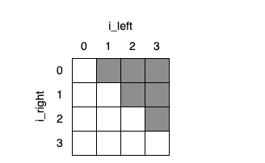

假设我们需要查找重复的文件，比如文本文档等，虽然两个文件的命名是相同的，但是其内容不一定一致。因此我们必须比较两者的内容才能确定两者是否一致，但是如果文件数量很多的情况下，这样的比较将会非常耗时。
当然，我们需要简单的估算一下这个“慢”的程度到底是怎么样的。
首先，$N$个对象的比较将会进行$N(N-1)$次数，然后去掉重复的比较，那么结果是$N(N-1)/2=(N^2-N)/2$次。
随着$N$变得越来越大，其结果与$N^2$越发趋近，那么就可以说该比较方式的算法复杂度是$O(N^2)$。
简而言之，文件数量增加2倍，则比较耗时增加4倍，即变“慢”4倍。

随着文件的增加，比较速度变慢是一个不可避免的事实，但是我们可以通过使用更优的解决方法，将这个耗时尽可能的降低。
如果为每个文件生成一个更短的标识符，这个标识符仅取决于文件所包含的字节，则可以将具有相同标识符的文件分组在一起，并且只比较同组的文件。这种方法更快速，因为只需要对相同组中的文件进行逐字节比较。
<!--more-->

# 开始
首先，我们从最简单也是最缓慢的诸字节比较法对文件进行比较，如下代码：
```python
def find_duplicates(filenames):
    matches = []
    for left in filenames:
        for right in filenames:
            if same_bytes(left, right):
                matches.append((left, right))
    return matches

def same_bytes(left_name, right_name):
    left_bytes = open(left_name, "rb").read()
    right_bytes = open(right, "rb").read()
    return left_bytes == right_bytes


if __name__ == "__main__":
    duplicates = find_duplicates(sys.argv[1:])
    for (left, right) in duplicates:
        print(left, right)
```
上述代码的运行结果存在一个问题：每一个文件都会被比较两次，并且每个文件都与自身进行了比较。这个明显是没有必要的，因此需要修改代码中的嵌套循环，以便于只进行一次比较：
```python
def find_duplicates(filenames):
    matches = []
    for i_left in range(len(filenames)):
        left = filenames[i_left]
        for i_right in range(i_left):
            right = filenames[i_right]
            if same_bytes(left, right):
                matches.append((left, right))
    return matches
```
其遍历顺序如下图所示：


# 文件哈希
与其将文件与每个其他文件进行比较，不如对每个文件进行一次处理，按照文件内容生成一个简短的标识符，然后只比较具有相同标识符的文件，这意味着两个文件可能内容相同。
